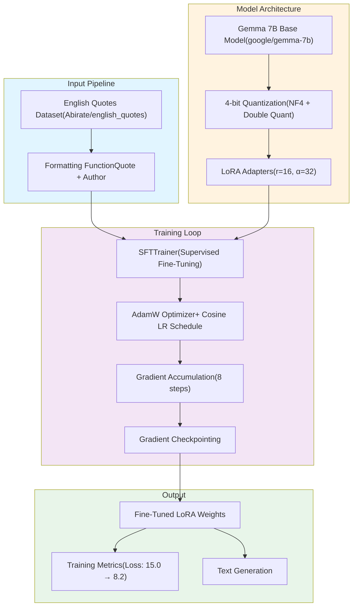

# QLoRA-Fine-Tuning-With-Gemma-7B
A Fine Tuning implementation using Quantized Low Rank Adaptation to adapt Google's Gemma 7B language model on a custom quotes dataset.

The implementation uses **Hugging Face Transformers**, **PEFT (Parameter-Efficient Fine-Tuning)**, and **BitsAndBytes** for quantization, showcasing GPU-based fine-tuning on a local machine with minimal computational overhead.

---

## Features

- **4-bit Quantization** with NF4 (NormalFloat4) precision
- **QLoRA** - Low-rank adaptation for memory-efficient training
- **Gradient Checkpointing** to reduce VRAM usage
- **Mixed Precision Training** (FP16) for faster computation
- **Before/After Comparison** of model outputs
- **Local Model Storage** support for offline development
  
---

- ## Architecture


---

### Hardware Requirements

**Minimum Requirements:**
- GPU: NVIDIA RTX 4060 (8GB VRAM) or equivalent
- RAM: 16GB system memory
- Storage: ~30GB for model + checkpoints
- CUDA: 11.8 or higher

**Tested Configuration:**
- GPU: NVIDIA GeForce RTX 4060 Laptop GPU
- CUDA Version: 12.1
- Python: 3.10

## Installation

### Prerequisites
```bash
# Create virtual environment
python3.10 -m venv venv
source venv/bin/activate  # On Windows: venv\Scripts\activate

# Install dependencies
pip install torch torchvision torchaudio --index-url https://download.pytorch.org/whl/cu121
pip install transformers datasets peft trl bitsandbytes accelerate
```

---

### Python Version Conflicts
- Use Python 3.10 (tested and stable)
- Avoid Python 3.12+ (compatibility issues with some dependencies)
  
---

### Download Base Model

**Option 1: Hugging Face Hub**
```python
# Requires HuggingFace token for gated models
```

**Option 2: Local Storage**
```bash
# Download Gemma 7B from Hugging Face
git lfs install
git clone https://huggingface.co/google/gemma-7b

# Update model_path in notebook
model_path = "/path/to/your/gemma-7b"
```

---

## Usage

### 1. Configure Environment
```python
import os
os.environ["WANDB_DISABLED"] = "true"
os.environ["HF_TOKEN"] = "your_huggingface_token_here"
```

### 2. Run Training
```bash
# Launch Jupyter
jupyter notebook QLoRAwithGemma7B.ipynb

# Or run as script
jupyter nbconvert --to script QLoRAwithGemma7B.ipynb
python QLoRAwithGemma7B.py
```

### 3. Test Fine-Tuned Model
```python
# Generate text with fine-tuned model
prompt = "Quote: Imagination is more"
output = generate_text(prompt, max_new_tokens=100)
print(output)
```

---

## License

MIT License

---
